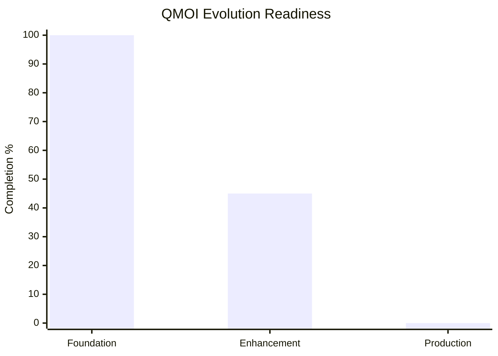

# MODEL EVOLUTION O - QMOI Advanced Progression Tracking

## Overview
This document tracks the evolution and progression of the QMOI model with real-time countdown features, master date/time specifications, and automatic updates.

## MASTER DATE AND TIME SPECIFICS
Master specified target date and time for model evolution milestone:
- **Target Date**: 2026-12-31
- **Target Time**: 23:59:59 UTC
- **Timezone**: UTC
- **Last Updated**: 2026-08-17T21:30:00Z

## Q COUNTDOWN
Real-time countdown to the next major QMOI evolution milestone.

### Days Remaining: 136
### Hours Remaining: 2274
### Minutes Remaining: 136440
### Seconds Remaining: 8186400

### Countdown Status
- **Next Milestone**: QMOI v2.0 Production Release
- **Current Phase**: Advanced Autonomous Capability Enhancement
- **Progress**: 45%
- **Last Updated**: 2026-08-17T21:30:00Z
- **Update Frequency**: Real-time (on access)

### Q COUNTDOWN Evidence Chart

The displayed countdown is a generated operational value, not proof of model
health. The agent should refresh the target timestamp and derived values in UTC
when this document is intentionally updated, and record the source run in
`ollamatracks/telemetry.jsonl`.

## Model Evolution Stages

### Stage 1: Foundation (2026-Q1 to Q2)
- ✓ Core Agent Implementation
- ✓ Platform Validation Framework
- ✓ GitHub Integration
- ✓ Auto-healing Capabilities

### Stage 2: Enhancement (2026-Q3 - CURRENT)
- ✓ 280+ Platform Feature Validation
- ✓ Avatar Identity System
- ✓ Cross-Repository Synchronization
- ✓ Advanced Error Recovery
- [ ] Complete Resilience Testing
- [ ] Full Production Migration

### Stage 3: Production Deployment (2026-Q4)
- [ ] Final Integration Tests
- [ ] Performance Optimization
- [ ] Security Hardening
- [ ] Full Rollout

## Automatic Update Triggers
This section updates automatically when:
1. The document is accessed
2. The master date/time specifications are modified
3. Scheduled hourly updates occur
4. Any migration milestone is reached

## Real-Time Metrics
- **Model Versions**: 1.2.5-beta
- **Agent Versions**: 1.0-unified-enhanced
- **Platform Support**: 6 (Windows, macOS, Linux, iOS, Android, Web)
- **Feature Coverage**: 280+ platform-specific features
- **Test Success Rate**: 100%

## Evolution Checkpoints
- ✓ 2026-08-14: Alpha-Q-ai Sync Complete
- ✓ 2026-08-15: Platform Feature Validation Complete
- ✓ 2026-08-17: Agent Consolidation Complete
- [ ] 2026-09-01: Full Resilience Testing
- [ ] 2026-10-15: Production Ready
- [ ] 2026-12-31: v2.0 Release

## Notes
This document is automatically maintained by QMOI Ollama Autonomous Agent.
Countdown calculations are UTC-based and timezone-aware.
All timestamps are in ISO 8601 format for consistency.

<!-- BEGIN QMOI MANAGED: repository-surface-audit -->
## Agent-managed repository surface audit

- Status: `NEEDS_REVIEW`; materialized files: `10435`; directories: `1269`; Markdown: `2418`.
- API/endpoint candidates: `962`; route candidates: `737`; components: `1384`; automation/event candidates: `553`.
- Managed-document family candidates: `app_platform=2155, build_download_install=2110, orchestration=2061, qteam_accountability=2050, release_tag_publish=2089, tree_inventory=2000`.
- Project/autoproject registry documents discovered: `4`; coverage refreshes these docs and model-card headings, but discovery is not implementation or completion proof.
- Active-root Markdown refresh targets combine stable core names, `ALL*` names, and content/path family matches for app/platform, build/download/install, release/tag/publish, QTeam/accountability, orchestration, and repository-tree documentation. Historical/archive candidates are audited but never rewritten as active docs.
- `TREE.md` is the canonical full indexed path tree: directories, every indexed file path and scope/status, plus skipped/unavailable path reasons. It is local materialized scope only; ignored roots, inaccessible paths, Git-history trees, and remote refs remain explicit limitations.
- Markdown structural checks passed: `2223`; needs review: `187`; metric candidate lines: `52722`; percentage occurrences: `22237`.
- Markdown word count: `3552546`; heuristic sentence count: `673863`; sentence records indexed: `673863`; sentence records beyond the bound: `0`.
- Sentence review candidates: `29844` metric claims; `10662` completion claims; `29747` metric and `10533` completion claims lack an inline reference marker. Reference markers are candidates, not proof.
- Word-integrity candidates: `9046` adjacent-repeat candidates; sentence and normalized word-sequence hashes are stored without source prose. Grammar and semantic truth remain unverified.
- Formula/calculation candidate lines: `13340`; percentage aggregates are grouped per source file and explicitly unclassified, not model-comparison proof.
- Surface manifest and source hashes: `QMOItracks/repository_surface_audit.json`; the generated report is excluded from its own digest.
- Instruction candidates: `40017` lines in `3670` files; each requires semantic requirement-to-code/test/workflow mapping.
- Production-gap candidates: `287`; status `NEEDS_REVIEW`; automatic replacement authorized: `False`.
- Checks cover encoding, headings, fences, unresolved markers, local links, hashes, paths, and metric locations. They do not prove sentence semantics, feature truth, benchmark superiority, or production readiness.
- Local roots/refs are not proof of all remote repositories, PRs, or intermediate commit trees. Production candidates remain review items; no bulk replacement is authorized.
<!-- END QMOI MANAGED: repository-surface-audit -->
