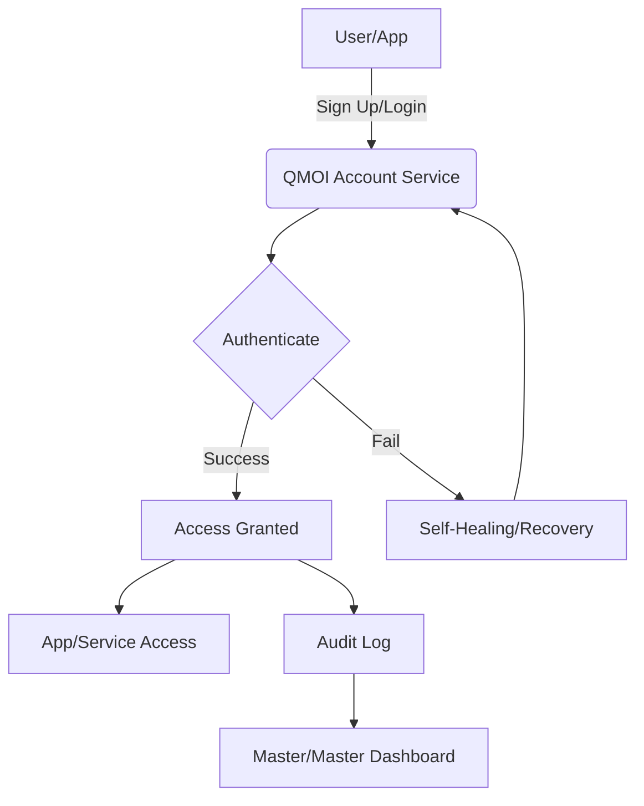

<!-- LION_VALIDATION_START -->

## 🦁 L — Validated by QMOI Lion

- validated: yes
- validator: QMOI Lion
- timestamp: 2025-10-25T00:32:32.231969Z
- note: Auto-inserted by `scripts/autotag_md_with_lion.py` (creates .bak backup)
<!-- LION_VALIDATION_END -->

# QMOIACCOUNTS.md

## QMOI Universal Account System

### Overview

QMOI Accounts provide a single, secure identity for users across all QMOI apps, platforms, and services—similar to Google Accounts. This enables seamless login, account management, and automation for both users and developers.

### Key Features

- **Single Sign-On (SSO):** One account for all QMOI apps and services.
- **Cross-Platform:** Use your QMOI account on web, mobile, desktop, and third-party platforms.
- **API & Automation:** Integrate QMOI Accounts into any app or workflow with robust APIs and automation hooks.
- **Master/Master Controls:** Master users have override, audit, and advanced management capabilities.
- **Security & Privacy:** Encrypted, access-controlled, and compliant with global standards.
- **Self-Healing:** Automated account recovery, provisioning, and error fixing—no developer intervention needed.
- **Audit Logging:** All account actions are logged and visualized for transparency.

### How to Use QMOI Accounts on Any Platform

1. **Sign Up:**
   - Visit any QMOI app or Qstore and select "Sign Up with QMOI Account."
   - Enter your email (e.g., username@qmail.com) and set a password.
   - Optionally, link third-party accounts (Google, Apple, etc.).
2. **Login:**
   - Use your QMOI credentials to log in to any QMOI app or partner platform.
   - Supports SSO, OAuth, and device-based login.
3. **Account Management:**
   - Access your account dashboard to update info, manage devices, and review activity.
   - Master users can view and manage all accounts, with override and audit features.
4. **Developer Integration:**
   - Use QMOI Account APIs to add login/signup to your app.
   - Automate user provisioning, permissions, and account recovery.
   - See API.md for endpoints and usage examples.

### Visual Workflow

### Automation & Self-Healing

- QMOI auto-fixes account issues, recovers lost access, and provisions new accounts as needed.
- Master/admins can trigger or override automation at any time.
- All actions are logged and visualized for compliance and transparency.

### Advanced User Distinction & Recognition

QMOI uses advanced AI-driven identification to recognize and distinguish each user, even across different accounts, devices, or sessions—including when a user is in the background or using another account. This is achieved through:

- **Behavioral Biometrics:** Typing patterns, navigation habits, and device usage.
- **Contextual Signals:** Location, device, time, and app usage context.
- **Multi-Modal Biometrics:** Face, voice, fingerprint, and other biometric data (where permitted).
- **Cross-Session Recognition:** QMOI links user actions and preferences across sessions and accounts, ensuring seamless experience and security.
- **Background Awareness:** QMOI can identify users even when they are not the active account, providing personalized suggestions, security alerts, or automation as needed.
- **Privacy & Security:** All recognition is privacy-respecting, encrypted, and user/audit-controlled. Master/admins can review and override as needed.

#### Automation

- QMOI auto-detects and adapts to user context, switching profiles or providing relevant actions without manual intervention.
- All recognition events are logged and auditable by master/master.

### Security & Privacy

- All data is encrypted in transit and at rest.
- Users can export, review, or delete their data at any time.
- Master/admins have access to advanced security controls and audit logs.

### See Also

- QMOIMEMORY.md
- QMOIAPPS.md
- Qstore.md
- API.md

<!-- QMOI_VALIDATION_START -->

{
"file": "qmoi-enhanced/QMOIACCOUNTS.md",
"validated_at": "2025-10-26T20:51:24.705809Z",
"validator": "QMOI Lion (automated)",
"checks": [
{
"name": "title_present",
"ok": true,
"detail": "QMOIACCOUNTS.md"
},
{
"name": "links",
"ok": true,
"detail": []
}
],
"passed": true,
"summary": {
"total_checks": 2,
"passed": true
}
}

<!-- QMOI_VALIDATION_END -->

<!-- AUTOMATED-CHECK: 2025-11-11 11:36:36 UTC -->

<!-- BEGIN QMOI MANAGED: repository-surface-audit -->
## Agent-managed repository surface audit

- Status: `NEEDS_REVIEW`; materialized files: `10435`; directories: `1269`; Markdown: `2418`.
- API/endpoint candidates: `962`; route candidates: `737`; components: `1384`; automation/event candidates: `553`.
- Managed-document family candidates: `app_platform=2155, build_download_install=2110, orchestration=2061, qteam_accountability=2050, release_tag_publish=2089, tree_inventory=2000`.
- Project/autoproject registry documents discovered: `4`; coverage refreshes these docs and model-card headings, but discovery is not implementation or completion proof.
- Active-root Markdown refresh targets combine stable core names, `ALL*` names, and content/path family matches for app/platform, build/download/install, release/tag/publish, QTeam/accountability, orchestration, and repository-tree documentation. Historical/archive candidates are audited but never rewritten as active docs.
- `TREE.md` is the canonical full indexed path tree: directories, every indexed file path and scope/status, plus skipped/unavailable path reasons. It is local materialized scope only; ignored roots, inaccessible paths, Git-history trees, and remote refs remain explicit limitations.
- Markdown structural checks passed: `2223`; needs review: `187`; metric candidate lines: `52722`; percentage occurrences: `22237`.
- Markdown word count: `3552546`; heuristic sentence count: `673863`; sentence records indexed: `673863`; sentence records beyond the bound: `0`.
- Sentence review candidates: `29844` metric claims; `10662` completion claims; `29747` metric and `10533` completion claims lack an inline reference marker. Reference markers are candidates, not proof.
- Word-integrity candidates: `9046` adjacent-repeat candidates; sentence and normalized word-sequence hashes are stored without source prose. Grammar and semantic truth remain unverified.
- Formula/calculation candidate lines: `13340`; percentage aggregates are grouped per source file and explicitly unclassified, not model-comparison proof.
- Surface manifest and source hashes: `QMOItracks/repository_surface_audit.json`; the generated report is excluded from its own digest.
- Instruction candidates: `40017` lines in `3670` files; each requires semantic requirement-to-code/test/workflow mapping.
- Production-gap candidates: `287`; status `NEEDS_REVIEW`; automatic replacement authorized: `False`.
- Checks cover encoding, headings, fences, unresolved markers, local links, hashes, paths, and metric locations. They do not prove sentence semantics, feature truth, benchmark superiority, or production readiness.
- Local roots/refs are not proof of all remote repositories, PRs, or intermediate commit trees. Production candidates remain review items; no bulk replacement is authorized.
<!-- END QMOI MANAGED: repository-surface-audit -->
